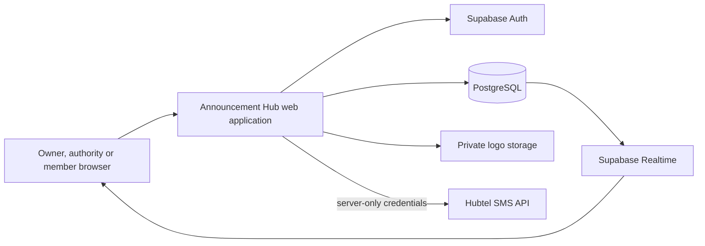

# Technical architecture

Last reviewed: 25 September 2026

## 1. Technology stack

| Area | Current choice |
| --- | --- |
| UI | React 19, Next.js 16-compatible application structure, TypeScript |
| Build/runtime adapter | Vinext and Vite |
| Styling | CSS design tokens, Tailwind tooling and reusable UI primitives |
| Icons | Lucide React |
| Validation | Zod at server request boundaries |
| Database and auth | PostgreSQL and Supabase |
| Object storage | Private Supabase Storage bucket for organization logos |
| Live updates | Supabase Realtime Postgres changes |
| SMS provider adapter | Hubtel, disabled by default |
| Public preview | GitHub Pages static build |
| CI | GitHub Actions validation and Pages deployment |

Dependency versions are pinned through `package-lock.json`.

## 2. Runtime topology

The GitHub Pages preview contains only the browser interface. Server API routes, secret credentials and real provider calls require a full-stack host.

## 3. Application boundaries

### Browser-safe code

- role-specific UI and responsive navigation;
- theme selection;
- Supabase publishable-key client;
- password, OTP and OAuth entry points;
- membership-scoped organization identity reads;
- owner branding upload and update requests;
- tenant-filtered Realtime subscription.

### Server-only code

- secret/service Supabase client;
- announcement publication and authoritative audience resolution;
- Hubtel credentials and outbound requests;
- SMS authorization, idempotency and ledger writes.

No secret or service-role credential may use a `NEXT_PUBLIC_` environment variable.

## 4. Main database model

| Table | Purpose |
| --- | --- |
| `profiles` | User-owned display and verified phone data |
| `organizations` | Tenant identity and globally unique organization code |
| `organization_branding` | Two colors, private logo path and updater |
| `memberships` | User-to-organization role, rank, status and reference |
| `groups` | Departments, offices, courses, classes and projects |
| `group_members` | Membership of organizational groups |
| `authority_grants` | Time-bound publish permission for an authority and group |
| `invitations` | Hashed member invitations and intended role |
| `imports` | Individual, CSV, paste or directory import tracking |
| `announcements` | Message, priority, publication state and client idempotency key |
| `announcement_audiences` | Selected groups |
| `announcement_individual_audiences` | Selected individual memberships |
| `announcement_exclusions` | Individuals removed from a broad audience |
| `recipient_deliveries` | Immutable recipient snapshot and channel state |
| `read_receipts` | Evidence that a member read a delivery |
| `delivery_attempts` | Provider attempts, status and idempotency |
| `organization_sms_settings` | Per-tenant sender, fallback and spend controls |
| `sms_ledger` | Estimates, charges, refunds and adjustments |
| `audit_events` | Security and operational audit trail |

Composite foreign keys bind audience and delivery rows to the same organization and prevent cross-tenant references.

## 5. Tenant and authorization model

All application tables in the exposed `public` schema have Row Level Security enabled. Anonymous clients have no public table grants. Authenticated grants are explicit and limited by operation.

Private authorization helpers determine whether the current `auth.uid()` is:

- an active organization member;
- an active organization owner;
- permitted to publish to a group.

These helpers are `SECURITY DEFINER` only where cross-policy lookup requires it, live in the non-exposed `private` schema, use an empty search path and are not executable by anonymous users.

The organization identity update RPC is deliberately `SECURITY INVOKER`. It runs as the caller, relies on owner RLS policies, validates tenant-prefixed logo paths and updates organization and branding rows in one database transaction.

## 6. Organization-code integrity

Organization codes are protected at three levels:

1. the UI normalizes input;
2. application validation enforces `^[A-Z0-9][A-Z0-9-]{3,31}$`;
3. PostgreSQL enforces the format check and unique constraint.

The database constraint is the final protection against race conditions. A duplicate insert or update returns PostgreSQL code `23505`, which the interface maps to a clear user-facing message.

## 7. Organization branding synchronization

1. A signed-in owner edits the name, code, colors or logo.
2. New PNG/JPEG logo data is uploaded to a unique tenant-prefixed path.
3. The security-invoker RPC atomically updates the organization and branding rows.
4. If the RPC fails, the newly uploaded object is removed.
5. On success, obsolete logo objects are cleaned up.
6. Owners, authorities and members load the branding through their active membership.
7. Realtime update events cause open member sessions to reload the tenant identity.
8. Private logos are displayed using one-hour signed URLs.

The same `BrandData` and CSS custom properties are used by desktop and mobile. Cross-device behavior is presentation-responsive, not separate stored themes.

## 8. Authentication

- Supabase password sign-in.
- Email and phone OTP requests with automatic account creation disabled for ordinary sign-in.
- Google OAuth using the PKCE callback route.
- Server-side cookie refresh proxy using `getClaims()`.
- Safe callback `next` path validation to prevent open redirects.
- Password recovery with a 15-character minimum.
- Owner setup is completed only after verified authentication.
- Public member self-registration is not enabled; member accounts are intended to originate from invitations.

## 9. Announcement publication security

`POST /api/announcements/publish` validates a strict payload and never trusts the browser’s recipient count. It checks tenant membership and authority scope with the server-only client, rejects cross-tenant IDs, resolves active recipients, batches inserts and records an audit event.

Current limitation: the multi-step publication uses compensating deletion for an unpublished draft rather than one PostgreSQL transaction. Moving the complete publication operation into a reviewed database transaction is a recommended hardening step before production.

## 10. SMS integration

The Hubtel adapter uses HTTP Basic authentication in a header and does not place credentials in a quick-send URL. SMS sending is disabled unless the complete server configuration and explicit enable flag are present.

The send endpoint checks:

- authenticated requester;
- tenant and publishing authority;
- fallback due time;
- missing read receipt;
- verified recipient phone;
- organization SMS settings;
- test allowlist when in test mode;
- daily limit;
- one-attempt-per-recipient constraint.

The status endpoint maps provider responses back to internal delivery states. Provider callbacks and scheduled polling remain deployment work.

## 11. Static preview and full-stack deployment

The repository produces two builds:

- `npm run build`: full application/server build;
- `npm run build:pages`: static GitHub Pages preview.

GitHub Pages is for design and workflow review only. A production deployment must provide Node-compatible server execution, protected environment variables, the configured Supabase project and HTTPS.

## 12. Validation

Current automated checks include:

- ESLint;
- unit tests for organization-code normalization, audience resolution, Ghana phone normalization and SMS segment calculation;
- full application build;
- static Pages build;
- pgTAP catalogue tests for RLS coverage, grants, tenant constraints, SMS idempotency, unique organization codes, identity-update permissions and Realtime publication configuration.

The pgTAP database suite has not been executed locally because Docker is not installed on the current workstation. This is a documented verification gap, not a passing result.
